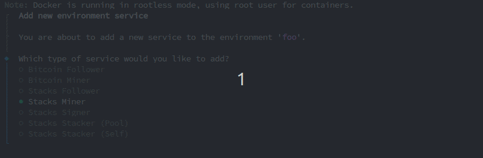
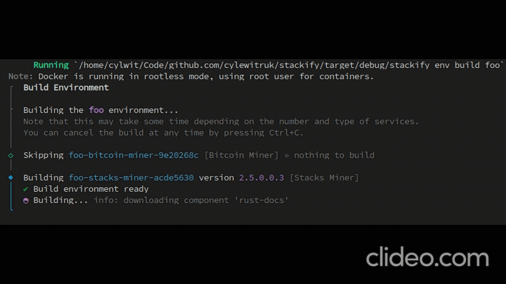
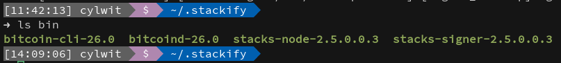

# Stackify

```text
 ____  _             _    _  __    
/ ___|| |_ __ _  ___| | _(_)/ _|_   _ 
\___ \| __/ _` |/ __| |/ / | |_| | | |
 ___) | || (_| | (__|   <| |  _| |_| |
|____/ \__\__,_|\___|_|\_\_|_|  \__, |
                                |___/ 
```

Welcome to Stackify! A tool which aims to enable _consistent_ and _reproducable_ Stacks
environments, including all dependencies, in **regtest** (_and possibly additional environments later on_). No more fiddling with Docker compose and configuration files - easily compose
environments with an interactive interface, and import/export environments for exact
reproduction on other machines.

## System Requirements

Stackify requires that you have [Docker](https://www.docker.com/) installed on your machine and enough resources to run the environments that you create. Due to the nature of freedom in how these environments may be constructed, minimum specs can't be provided, however in general at least a quad-core machine, 8GB RAM and 20GB of storage is recommended for even the smallest of environments.

In general, the Stackify images including all needed source code and build tools will consume just under `3GB` of space, and resulting artifacts another `500MB`. There must be space remaining for service containers and their deltas, logs, etc.

Stackify _does not require_ that Rust is installed locally - it will be provided via its Docker containers.

## Getting Started

### Installation

First, please ensure that you've read [System Requirements](#system-requirements). Download the binary for your OS/arch or clone this repo and build the project yourself.

To install Stackify, run `stackify install` and follow the prompts.

This will create an application directory at `~/.stackify`, copy built-in assets such as configuration files, templates, Dockerfiles, scripts, etc., download [Bitcoin Core](https://bitcoincore.org/), build required Docker images and setup/configure the Stackify application database.

**Note** that Stackify does require ~3GB of space.

### Create your first environment

Stackify is built around the concept of **environments**, which allow you to create completely isolated environment configurations with different ccompositions of services, versions and configurations.

To create a new environment, run the following command (replacing `FOO` with your desired name for the environment):
```
stackify environment create FOO
```

Once your environment is created, you will need to add services to it for it to be usable.

#### Add Services

Each environment can have one or many services. Stackify services represent a specific version and configuration of Stacks network components. Stackify provides an interactive prompt for configuring new services in environments. 

To add a new service, run the following command (replacing `FOO` with the name of your environment):

```stackify environment service add --env FOO```

Which will present you with an interactive prompt of available services. Depending on the service you select, different configuration options will be available to you. For example, when configuring a [Stacks Signer](https://docs.stacks.co/nakamoto-upgrade/signing-and-stacking/running-a-signer), you will be prompted to specify which Stacks Node to receive events from:



#### Build the Environment

Before an environment can be launched, it must first be built. This will use Stackify's own Docker build containers to produce the required binaries of the correct targets and versions to be run within the Stackify runtime containers. _Note that since the runtime containers are the targets, the built binaries may not necessarily be runnable directly by you on your system._



Once the build has completed, you will find the built binaries in `~/.stackify/bin/` and it should look something like the following (depending on the services configured):



#### Start the Environment

To start the environment, which will create the necessary Docker resources and containers, generate and install related configuration files, and start the containers. Start the environment using the `environment start` command (replacing `FOO` with the name of your environment):

```
stackify env start FOO
```


